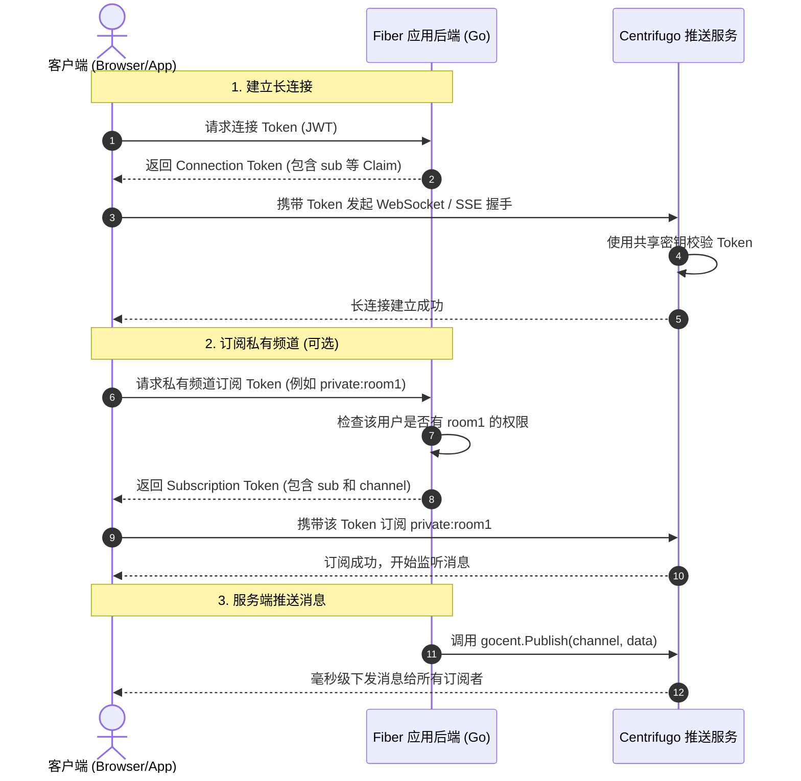

# Centrifugo v6 Go Fiber 框架集成与客户端长连接接入指南

本指南详细介绍了如何使用 **Go Fiber 框架** 搭建应用服务器，通过官方 HTTP API SDK（`gocent`）与 Centrifugo 交互，并在客户端实现 **WebSocket**、**SSE** 及 **Unidirectional SSE（原生 EventSource）** 接入。

---

## 1. 核心架构交互流



---

## 2. 步骤一：安装 Go 后端依赖

在您的 Go 项目目录下运行以下命令安装所需依赖包：

```bash
# 安装 Fiber Web 框架
go get github.com/gofiber/fiber/v2

# 安装 JWT 签发库 (Centrifugo v6 推荐使用 v5 版本)
go get github.com/golang-jwt/jwt/v5

# 安装 Centrifugo 官方 HTTP API SDK
go get github.com/centrifugal/gocent/v2
```

---

## 3. 步骤二：Go Fiber 服务端开发

创建后端服务文件（如 `main.go`），实现连接鉴权、通道鉴权与消息推送 API：

```go
package main

import (
	"context"
	"log"
	"time"

	"github.com/centrifugal/gocent/v2"
	"github.com/gofiber/fiber/v2"
	"github.com/golang-jwt/jwt/v5"
)

// 生产环境下请从环境变量加载这些敏感密钥
const (
	// 必须与 centrifugo/config.yaml 中的 client.token_hmac_secret_key 一致
	HMACSecretKey = "prod-super-secure-jwt-hmac-secret-key-change-me"
	// 必须与 centrifugo/config.yaml 中的 api_key / CENTRIFUGO_API_KEY 一致
	CentrifugoAPIKey = "prod-super-secure-http-api-key-change-me"
	// Centrifugo 的 HTTP API 地址
	CentrifugoAPIAddr = "http://localhost:8000"
)

var centrifugoClient *gocent.Client

func main() {
	// 1. 初始化 Centrifugo HTTP API 客户端 (用于推送)
	centrifugoClient = gocent.New(gocent.Config{
		Addr: CentrifugoAPIAddr,
		Key:  CentrifugoAPIKey,
	})

	app := fiber.New()

	// 2. 路由定义
	// A. 签发客户端长连接 Token (WebSocket / SSE 共用)
	app.Get("/api/centrifugo/connect-token", handleConnectToken)

	// B. 签发私有通道的订阅 Token (针对 private 命名空间)
	app.Post("/api/centrifugo/subscribe-token", handleSubscribeToken)

	// C. 后端模拟业务推送 (推送数据到各种频道)
	app.Post("/api/centrifugo/publish", handlePublish)

	log.Fatal(app.Listen(":3000"))
}

// ============================================================================
// 1. 签发长连接 JWT Token (用于 Websocket/SSE 握手)
// ============================================================================
func handleConnectToken(c *fiber.Ctx) error {
	// 模拟从 Session 或 Context 中获取当前登录用户的 UID
	userID := "user_9958" 

	// 设定 JWT Claims
	claims := jwt.MapClaims{
		"sub": userID,                                         // 必须：订阅用户唯一ID
		"exp": time.Now().Add(1 * time.Hour).Unix(),           // 强烈建议：过期时间 (例如 1 小时)
		"info": map[string]interface{}{                        // 可选：附加信息，会广播给其他在线用户
			"username": "张三",
			"role":     "vip_member",
		},
	}

	// 签发 JWT (使用 HS256 算法)
	token := jwt.NewWithClaims(jwt.SigningMethodHS256, claims)
	tokenString, err := token.SignedString([]byte(HMACSecretKey))
	if err != nil {
		return c.Status(fiber.StatusInternalServerError).JSON(fiber.Map{"error": "签名失败"})
	}

	return c.JSON(fiber.Map{
		"token":   tokenString,
		"user_id": userID,
	})
}

// ============================================================================
// 2. 签发私有频道 (private:*) 订阅 Token
// ============================================================================
func handleSubscribeToken(c *fiber.Ctx) error {
	type SubscribeRequest struct {
		Channel string `json:"channel"` // 例如: "private:chat_room_1"
		Client  string `json:"client"`  // 连接的 Client ID (由前端 SDK 自动获取并传给后端)
	}

	var req SubscribeRequest
	if err := c.BodyParser(&req); err != nil {
		return c.Status(fiber.StatusBadRequest).JSON(fiber.Map{"error": "参数解析失败"})
	}

	// 模拟校验：检查当前登录用户是否有权限订阅该私有频道
	userID := "user_9958"
	if req.Channel == "" {
		return c.Status(fiber.StatusForbidden).JSON(fiber.Map{"error": "无权访问该频道"})
	}

	// 订阅 Token 的 Claims，除 sub 外必须指定 "channel"
	claims := jwt.MapClaims{
		"sub":     userID,
		"channel": req.Channel, // 核心：限制此 Token 仅能订阅这一个特定频道
		"client":  req.Client,  // 可选但推荐：绑定当前客户端实例 ID，防 Token 窃取
		"exp":     time.Now().Add(15 * time.Minute).Unix(),
	}

	token := jwt.NewWithClaims(jwt.SigningMethodHS256, claims)
	tokenString, err := token.SignedString([]byte(HMACSecretKey))
	if err != nil {
		return c.Status(fiber.StatusInternalServerError).JSON(fiber.Map{"error": "订阅签名失败"})
	}

	return c.JSON(fiber.Map{
		"token": tokenString,
	})
}

// ============================================================================
// 3. 后端推送消息到各种频道命名空间
// ============================================================================
func handlePublish(c *fiber.Ctx) error {
	type PublishRequest struct {
		Namespace string                 `json:"namespace"` // "public" / "private" / "user" / "notification"
		ChannelID string                 `json:"channel_id"`// 具体的业务通道 ID, 例如 "chat_room_1"
		Message   map[string]interface{} `json:"message"`   // 业务推送负载
	}

	var req PublishRequest
	if err := c.BodyParser(&req); err != nil {
		return c.Status(fiber.StatusBadRequest).JSON(fiber.Map{"error": "参数错误"})
	}

	// 拼接 Centrifugo 标准频道名称，格式为 "命名空间:频道标识"
	// 如 "public:chat_room_1" 或 "private:user_9958"
	fullChannel := req.Namespace + ":" + req.ChannelID

	// 写入时间戳和推送来源
	req.Message["server_timestamp"] = time.Now().Format("2006-01-02 15:04:05")
	req.Message["sender"] = "fiber-backend-api"

	// 序列化为字节流
	dataBytes, _ := c.App().Config().JSONEncoder(req.Message)

	// 调用 Centrifugo Go SDK 推送
	ctx, cancel := context.WithTimeout(context.Background(), 3*time.Second)
	defer cancel()

	err := centrifugoClient.Publish(ctx, fullChannel, dataBytes)
	if err != nil {
		return c.Status(fiber.StatusInternalServerError).JSON(fiber.Map{
			"error": "推送失败: " + err.Error(),
		})
	}

	return c.JSON(fiber.Map{"status": "ok", "channel": fullChannel})
}
```

---

## 4. 步骤三：客户端长连接接入

### 方案 A：WebSocket 客户端接入 (使用官方 SDK)

使用 WebSocket 是生产环境最推荐的连接形式，支持重连和订阅管理机制。

```html
<!DOCTYPE html>
<html lang="zh-CN">
<head>
    <meta charset="UTF-8">
    <title>Centrifugo WebSocket Demo</title>
    <!-- 引入 Centrifugo 官方 JS SDK (v5 版本) -->
    <script src="https://unpkg.com/centrifuge@5.0.1/dist/centrifuge.js"></script>
</head>
<body>
    <h3>Centrifugo WebSocket 实时消息监听</h3>
    <div id="messages"></div>

    <script>
        const log = (msg) => {
            document.getElementById('messages').innerHTML += `<p>${msg}</p>`;
        };

        // 1. 初始化 Centrifuge 客户端
        const centrifuge = new Centrifuge('wss://push.test.local/connection/websocket', {
            // 提供 getToken 钩子函数：
            // 当建立连接、或者 Token 即将过期 (exp 到期) 时，SDK 会自动请求此接口刷新 Token
            getToken: async function (ctx) {
                const response = await fetch('http://localhost:3000/api/centrifugo/connect-token');
                const data = await response.json();
                return data.token;
            }
        });

        // 2. 订阅公开命名空间频道 (无需额外订阅 Token)
        const publicSub = centrifuge.newSubscription('public:chat_room_1');
        publicSub.on('publication', function (ctx) {
            log(`[公开频道] 收到消息: ${JSON.stringify(ctx.data)}`);
        });
        publicSub.subscribe();

        // 3. 订阅私有命名空间频道 (需要额外的订阅 Token)
        const privateSub = centrifuge.newSubscription('private:secure_chat_1');
        
        // 当客户端发起私有频道订阅时，SDK 触发此回调以向后端申请订阅 JWT
        privateSub.on('subscribe', function (ctx) {
            log(`[私有频道] 正在申请订阅权限...`);
        });
        
        // 重写 getSubscriptionToken 流程，把 client_id 发送给后端
        privateSub.on('subRequest', async function (ctx) {
            const response = await fetch('http://localhost:3000/api/centrifugo/subscribe-token', {
                method: 'POST',
                headers: { 'Content-Type': 'application/json' },
                body: JSON.stringify({
                    channel: ctx.channel,
                    client: ctx.client
                })
            });
            const data = await response.json();
            ctx.resolve({ token: data.token });
        });

        privateSub.on('publication', function (ctx) {
            log(`[私有频道] 收到加密消息: ${JSON.stringify(ctx.data)}`);
        });
        privateSub.subscribe();

        // 4. 建立长连接
        centrifuge.connect();
    </script>
</body>
</html>
```

### 方案 B：SSE (Server-Sent Events) 双向长连接 (SDK 降级模式)

如果客户端在严格防火墙或公司网关拦截了 WebSocket 的环境下运行，可在初始化 SDK 时更改为 `sse` 传输协议以进行优雅降级，**无须修改业务逻辑与 API 路由**：

```javascript
const centrifuge = new Centrifuge('https://push.test.local/connection/sse', {
    transport: 'sse', // 强制指定长连接走 SSE 协议
    getToken: async function (ctx) {
        const response = await fetch('http://localhost:3000/api/centrifugo/connect-token');
        const data = await response.json();
        return data.token;
    }
});
centrifuge.connect();
```

### 方案 C：Unidirectional SSE 接入 (原生 EventSource 免 SDK)

对于只需单向接收推送数据而不需要向推送服务发送交互帧的前端应用，可以直接利用浏览器自带的 `EventSource` 发起 HTTP 直连。

由于原生 `EventSource` 不支持在头部传入鉴权 Token，认证参数和目标订阅频道必须进行 URL 编码后通过 `cf_connect` 查询参数传递：

```javascript
async function startNativeSSE() {
    // 1. 先向 Fiber 后端请求连接 Token
    const res = await fetch('http://localhost:3000/api/centrifugo/connect-token');
    const { token } = await res.json();

    // 2. 准备连接载荷
    const connectPayload = {
        token: token,
        // 原生单向连接必须在初始化连接时一次性声明要订阅的频道列表 (支持订阅多个)
        channels: ["public:chat_room_1", "notification:system_announce"]
    };

    // 3. 对载荷进行 URL 编码
    const encodedPayload = encodeURIComponent(JSON.stringify(connectPayload));
    const sseUrl = `https://push.test.local/connection/uni_sse?cf_connect=${encodedPayload}`;

    // 4. 发起原生 EventSource 连接
    const eventSource = new EventSource(sseUrl);

    eventSource.onmessage = function (event) {
        // 收到的是 JSON 格式的推送帧
        const message = JSON.parse(event.data);
        console.log("收到原生 SSE 消息：", message);
    };

    eventSource.onerror = function (err) {
        console.error("原生 SSE 链路异常断开，浏览器会自动发起重连", err);
    };
}

startNativeSSE();
```

---

## 5. 各频道的特点与推送测试命令

您可以通过向 Fiber 后端的 `/api/centrifugo/publish` 发送 POST 请求来测试向各类命名空间频道的推送：

1. **公开命名空间 (`public`)**
   - **推送命令**：
     ```bash
     curl -X POST http://localhost:3000/api/centrifugo/publish \
       -H "Content-Type: application/json" \
       -d '{"namespace":"public", "channel_id":"chat_room_1", "message":{"text":"大厅广播"}}'
     ```
2. **私有命名空间 (`private`)**
   - **推送命令**（只有后端能通过 API 往这里推送，且客户端订阅时会向后端请求 `/api/centrifugo/subscribe-token` 进行鉴权）：
     ```bash
     curl -X POST http://localhost:3000/api/centrifugo/publish \
       -H "Content-Type: application/json" \
       -d '{"namespace":"private", "channel_id":"secure_chat_1", "message":{"text":"这是一条加密的后台通知"}}'
     ```
3. **个人用户频道 (`user`)**
   - **推送命令**（专门定向推送给某个用户 UID，禁用上下线通知以提高吞吐量）：
     ```bash
     curl -X POST http://localhost:3000/api/centrifugo/publish \
       -H "Content-Type: application/json" \
       -d '{"namespace":"user", "channel_id":"user_9958", "message":{"text":"您收到一条红点提醒"}}'
     ```
4. **实时通知频道 (`notification`)**
   - **推送命令**（低敏感、高吞吐，不保留重连缓存的历史包）：
     ```bash
     curl -X POST http://localhost:3000/api/centrifugo/publish \
       -H "Content-Type: application/json" \
       -d '{"namespace":"notification", "channel_id":"system_announce", "message":{"text":"系统将于凌晨进行维护"}}'
     ```
