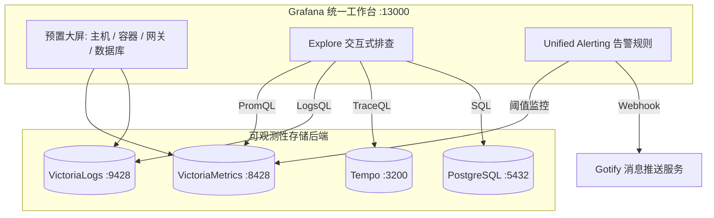

# Grafana 统一可观测性可视化控制台 (Visualization Hub)

Grafana 是整个可观测性体系的统一交互入口与数据可视化大屏。通过开箱即用的自动化供应（Provisioning）机制，将时序指标、结构化日志、分布式链路追踪以及业务关系型数据库集成在单一控制台内，实现指标突增 -> 链路定位 -> 日志排查的完整闭环。

---

## 📌 核心特性与架构定位

1. **定制容器镜像 (`Dockerfile`)**：
   - 基于官方稳定版镜像构建，预置并激活了官方 VictoriaLogs 插件（`victoriametrics-logs-datasource`），解决了原生 Grafana 无法直接解析 LogsQL 的问题。
2. **多源一体化供应 (Datasources Provisioning)**：
   - 自动预装并配置好 4 大核心数据源，启动即用，无需人工在界面反复填写 IP 与端口：
     - **VictoriaMetrics** (默认指标源，Prometheus 协议)
     - **VictoriaLogs** (日志数据源，LogsQL 原生协议)
     - **Tempo** (链路追踪数据源，TraceQL 协议与 OTLP)
     - **PostgreSQL / TimescaleDB** (业务数据源与系统元数据存储)
3. **元数据数据库外部化**：
   - 通过 `GF_DATABASE_TYPE=postgres` 将 Grafana 本身的仪表盘、组织、用户偏好存储在 PostgreSQL 容器中，彻底规避了默认 SQLite 出现的锁库与单点丢失风险。
4. **统一告警系统 (Unified Alerting)**：
   - 集成预置告警规则与 Gotify Webhook 通知通道，当系统负载过高或出现服务不可用时实时触发告警。

---

## 🏗️ 视图与数据源映射



---

## ⚙️ 环境变量与核心配置

服务定义于 `observability/grafana/docker-compose.yml`：

| 环境变量 | 默认值 | 作用描述 |
| :--- | :--- | :--- |
| `GRAFANA_PORT` | `13000` | 宿主机 Web 访问端口 |
| `GF_SECURITY_ADMIN_USER` | `admin` | 初始管理员登录用户名 |
| `GF_SECURITY_ADMIN_PASSWORD`| `Admin123!` | 初始管理员登录密码 |
| `GF_DATABASE_TYPE` | `postgres` | 元数据后端数据库驱动类型 |
| `GF_DATABASE_HOST` | `postgres:5432` | 元数据数据库主机地址与端口 |
| `GF_DATABASE_NAME` | `lunchbox` | 数据库名 |
| `GOTIFY_APP_TOKEN` | `${GOTIFY_APP_TOKEN}` | 预置 Gotify 告警通知端点通信 Token |

- **挂载目录**：
  - `${DATA_PATH}grafana:/var/lib/grafana`：插件与本地临时数据持久化。
  - `provisioning/`：数据源与告警规则自动化定义。
  - `dashboards/`：自动化载入的 JSON 仪表盘。

---

## 🚀 访问与排查指南

### 1. 登录控制台

启动服务后，使用浏览器访问：

- **访问地址**：`http://localhost:13000`（或对应反代域名）
- **默认用户**：`admin`
- **默认密码**：`Admin123!`（可在 `.env` 中修改）

### 2. 在 Explore 中进行跨信号排查 (Trace to Logs)

1. 点击左侧导航栏 **Explore**（指南针图标）。
2. **排查指标**：数据源选择 `VictoriaMetrics`，输入 PromQL 查找异常流量或错误率尖刺。
3. **定位调用链**：数据源选择 `Tempo`，使用 TraceQL 或 TraceID 查出响应慢或抛错的特定请求。
4. **深入日志细节**：数据源选择 `VictoriaLogs`，直接通过追踪到的 `container_name` 与时间范围执行精准过滤，定位报错行与调用堆栈。

---

## 🛠️ 常用运维指令

```bash
# 构建包含 VictoriaLogs 插件的定制 Grafana 镜像
docker compose build grafana

# 启动 Grafana 服务
docker compose up -d grafana

# 查看运行日志（排查插件加载或数据库连接）
docker compose logs -f grafana

# 重载 Provisioning 配置（无需重建容器即可刷新仪表盘定义）
docker compose restart grafana
```
