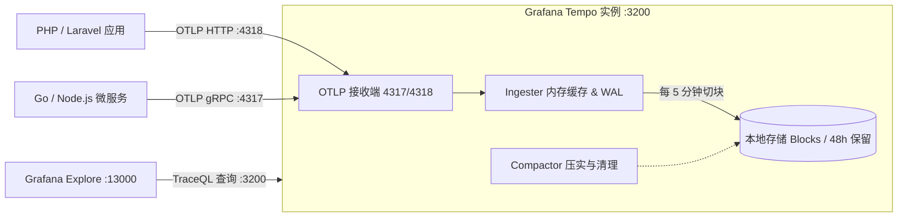

# Tempo 分布式链路追踪系统 (Tracing Engine)

Grafana Tempo 是一款高吞吐、经济高效且低维护开销的分布式追踪存储引擎。它专为大规模 Trace 数据设计，只需本地块存储（或对象存储）即可运行，彻底摆脱了传统 APM 方案对昂贵的 Elasticsearch 或 Cassandra 数据库的依赖。

---

## 📌 核心特性与架构定位

1. **原生 OpenTelemetry (OTLP) 接入**：
   - 原生监听 OTLP gRPC (`4317`) 与 OTLP HTTP (`4318`) 端口，任何支持 OpenTelemetry 标准的语言/框架（PHP/Laravel、Go、Node.js、Java、Python）均可开箱即用直接上报。
2. **免索引、块存储架构 (Blocks Storage)**：
   - 追踪数据先写入 WAL（预写日志），每 5 分钟压缩打包为不可变的 Parquet/Block 块，本地开发环境下默认保留 48 小时（`block_retention: 48h`）。
3. **TraceQL 丰富查询语言**：
   - 支持按 Span 属性、持续时长、HTTP 状态码、调用关系等精细过滤（如 `{ .http.status_code >= 500 && duration > 200ms }`）。
4. **全可观测性三位一体联动**：
   - 在 Grafana 中，Tempo 与 VictoriaMetrics 指标、VictoriaLogs 日志通过 `TraceID` 和 `SpanID` 实现无缝双向跳转。

---

## 🏗️ 追踪流转拓扑



---

## ⚙️ 配置文件解析 (`tempo.yaml`)

- **Distributor (接收分发器)**：

  ```yaml
  distributor:
    receivers:
      otlp:
        protocols:
          grpc:
            endpoint: 0.0.0.0:4317
          http:
            endpoint: 0.0.0.0:4318
  ```

- **Ingester (写入摄取器)**：
  - `max_block_duration: 5m`：当内存中 Block 达到 5 分钟时进行刷盘，确保数据安全性与查询响应平衡。
- **Compactor (压缩器)**：
  - `block_retention: 48h`：过期跟踪数据自动清理，防止开发环境磁盘爆满。
- **Storage (存储层)**：
  - WAL 路径：`/tmp/tempo/wal`。
  - Blocks 数据路径：`/tmp/tempo/blocks`（对应宿主机挂载目录 `${DATA_PATH}tempo/`）。

---

## 🚀 应用接入指南 (Client SDK Instrumentation)

任何遵循 OpenTelemetry 标准的应用，只需指定以下环境变量即可自动向 Tempo 上报追踪信息：

### 1. 通用 OpenTelemetry 环境变量

```bash
# 服务名称识别
OTEL_SERVICE_NAME=order-service
# 部署环境标识
OTEL_RESOURCE_ATTRIBUTES=deployment.environment=development

# 方式 A：使用 HTTP 上报 (推荐用于 PHP/Laravel 等瞬时请求场景)
OTEL_EXPORTER_OTLP_ENDPOINT=http://tempo:4318
OTEL_EXPORTER_OTLP_PROTOCOL=http/protobuf

# 方式 B：使用 gRPC 上报 (推荐用于常驻服务如 Go、Node.js、Octane)
OTEL_EXPORTER_OTLP_ENDPOINT=http://tempo:4317
OTEL_EXPORTER_OTLP_PROTOCOL=grpc
```

### 2. Laravel OpenTelemetry 接入参考

在 Laravel 应用中安装官方推荐扩展包（如 `open-telemetry/opentelemetry-auto-laravel`），并在 `.env` 中指定：

```env
OTEL_PHP_AUTOLOAD_ENABLED=true
OTEL_SERVICE_NAME=laravel-app
OTEL_TRACES_EXPORTER=otlp
OTEL_EXPORTER_OTLP_PROTOCOL=http/protobuf
OTEL_EXPORTER_OTLP_ENDPOINT=http://tempo:4318/v1/traces
```

---

## 🛠️ 常用运维指令

### 1. 验证 Tempo 服务健康状态

```bash
# 检查 Tempo 就绪状态（返回 200 OK 即为正常就绪）
docker compose exec tempo wget -q -O - http://127.0.0.1:3200/ready
```

### 2. 测试 OTLP HTTP 接口连通性

```bash
# 向 OTLP HTTP 接口发送空负载测试连通性
curl -i -X POST http://localhost:4318/v1/traces \
  -H "Content-Type: application/json" \
  -d '{}'
```

### 3. 服务启动与重启

```bash
# 启动 Tempo 服务
docker compose up -d tempo

# 查看实时运行日志
docker compose logs -f tempo
```
