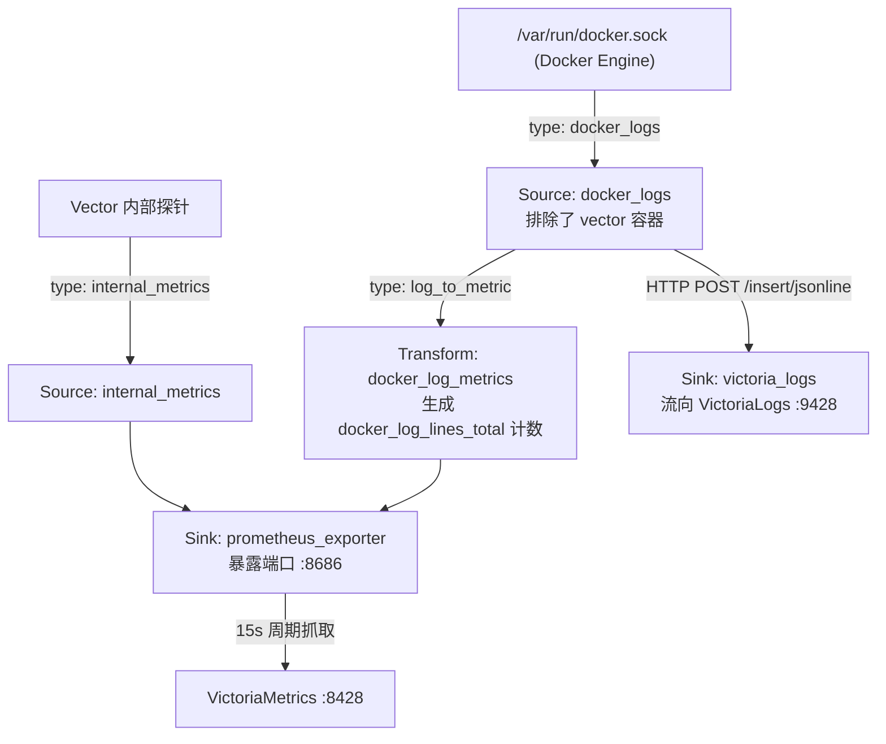

# Vector 可观测性数据流水线 (Data Pipeline & Collector)

Vector 是由 Datadog 开发并开源的超高性能、端到端可观测性数据管道代理（基于 Rust 编写）。在本项目中，Vector 充当核心边缘采集器（Collector / Forwarder），负责实时捕获所有 Docker 容器日志，进行结构化处理、指标转化，并分别流转至日志存储与指标系统。

---

## 📌 核心优势与定位

1. **Rust 原生性能与零 GC**：
   - 相比 Java/JVM 构建的 Logstash 或 Go 构建的采集器，Vector 内存开销极小（通常在 30MB 左右），CPU 占用低，无垃圾回收暂停。
2. **日志与指标（Log-to-Metric）跨模态融合**：
   - 不仅单纯转发日志，还能在数据流经内存时，实时将日志流量、特定错误模式等转换为 Prometheus 时序指标。
3. **单路拉取，消除自循环**：
   - 通过挂载 `/var/run/docker.sock` 实现全容器自动发现，并严格配置 `exclude_containers: [vector]` 杜绝自我采集引发的日志死循环风暴。

---

## 🏗️ 管道拓扑与数据流 (Pipeline Flow)



---

## ⚙️ 配置文件解析 (`vector.yaml`)

### 1. 数据输入源 (Sources)

- **`docker_logs`**：
  - 自动监听 Docker Daemon 套接字，实时接收所有容器的标准输出（`stdout`）与标准错误（`stderr`）。
  - 配置 `exclude_containers: [vector]`，防止采集自身日志造成无限放大。
- **`internal_metrics`**：
  - 采集 Vector 自身处理的事件总数、吞吐字节、队列积压状态。

### 2. 流式转换器 (Transforms)

- **`docker_log_metrics`**：
  - 类型：`log_to_metric`
  - 动作：统计容器日志生成速率，输出为名为 `docker_log_lines_total` 的计数器，并自动注入 `container_name: {{ container_name }}` 标签。这使得我们可以在 VictoriaMetrics/Grafana 中无需查询日志全文即可直接按秒级观测各应用的日志产出流量。

### 3. 数据输出端 (Sinks)

- **`victoria_logs`**：
  - 协议：HTTP POST 传输 `newline_delimited`（NDJSON / JSONLines）格式。
  - 目标端点：`http://victoria-logs:9428/insert/jsonline?_stream_fields=container_name,stream&_time_field=timestamp`。
- **`prometheus_exporter`**：
  - 协议：Prometheus Exporter 标准文本端点。
  - 监听地址：`0.0.0.0:8686`。
  - 数据内容：合并输出 `internal_metrics` 与 `docker_log_metrics`，由 VictoriaMetrics 周期性拉取。

---

## 🚀 启动与运维指南

### 1. 启动与重载

```bash
# 启动 Vector 采集管道
docker compose up -d vector

# 实时观察数据转发日志
docker compose logs -f vector

# 验证 vector 配置文件语法正确性
docker compose exec vector vector validate /etc/vector/vector.yaml
```

### 2. 检查指标输出

```bash
# 检查 Vector 暴露的 Prometheus 格式指标
docker compose exec victoria-metrics wget -q -O - http://vector:8686/metrics | grep docker_log_lines_total | head -n 10
```

输出示例：

```text
docker_log_lines_total{container_name="caddy"} 142
docker_log_lines_total{container_name="postgres"} 87
```

---

## 🔍 常见排查技巧

1. **容器无法启动，报权限拒绝**：
   - 检查宿主机 `/var/run/docker.sock` 的属主与权限，确保当前 Docker 用户组拥有读权限。
2. **日志写入出现背压或丢弃**：
   - 检查 VictoriaLogs 是否正常启动（`http://victoria-logs:9428/health`）。
   - 查看 Vector 的自监控指标：`vector_component_errors_total` 或 `vector_buffer_byte_size`。
