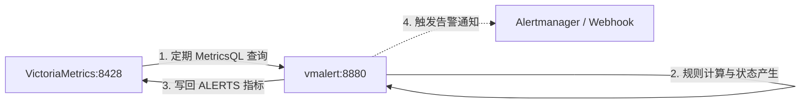

# vmalert 报警与记录规则评估服务

`vmalert` 是 VictoriaMetrics 生态中负责**规则评估与告警触发**的轻量级无状态服务。它定期对 VictoriaMetrics 发起 MetricsQL 查询计算，将评估生成的告警发送至 Alertmanager，并将 Recording Rules 结果与告警历史状态重新写入 VictoriaMetrics。

---

## 核心特性

- **MetricsQL 原生支持**：全面兼容 Prometheus 告警规则语法与 PromQL，并原生扩展 MetricsQL 算子（如 `running_max`、`range_normalize` 等）。
- **极低资源消耗**：纯 Go 编写的高并发架构，CPU 与内存开销仅为 Prometheus 评估引擎的数分之一。
- **状态写回与回放**：支持将告警生命周期指标（`ALERTS`、`ALERTS_FOR_STATE`）写回 VictoriaMetrics，重启后通过 `-remoteRead.url` 恢复告警状态，无缝防抖。
- **内置 Web UI**：提供简明清爽的规则与告警状态查看面板，支持动态查看 Groups、Rules 与当前 Firing 状态。
- **通知渠道广泛**：支持将告警通知分派至 Prometheus Alertmanager，或通过 Webhook 直接推送。

---

## 架构拓扑



---

## 端口与常用端点

| 端点路径 | 方法 | 功能描述 |
| :--- | :--- | :--- |
| `http://localhost:8880/` | GET | vmalert 内置控制台（查看规则与告警状态） |
| `http://localhost:8880/alerts` | GET | 查看当前处于 Firing / Pending 状态的告警列表 |
| `http://localhost:8880/rules` | GET | 查看加载的所有 Alerting & Recording Rules |
| `http://localhost:8880/health` | GET | 健康检查探针端点 |
| `http://localhost:8880/-/reload` | POST | 动态重新加载规则配置文件（无需重启容器） |
| `http://localhost:8880/metrics` | GET | vmalert 自身的 Prometheus 监控指标 |

---

## 预置告警规则

默认配置文件挂载于 `./alerts.yml`，包含以下典型基础监控规则组：

1. **服务连通性**：`InstanceDown`（任何被抓取目标 `up == 0` 持续 1 分钟）。
2. **宿主机资源压力**：
   - `HostHighCpuLoad`：CPU 使用率持续 5 分钟超过 85%。
   - `HostMemoryUnderPressure`：可用物理内存持续 5 分钟低于 10%。
   - `HostDiskSpaceLow`：根分区剩余空间持续 5 分钟低于 15%。
3. **容器级别告警**：`ContainerHighMemoryUsage`（容器内存占用超过配额 85%）。
4. **存储引擎自身健康**：`VictoriaMetricsWriteErrors`（检测是否有指标因异常被 VictoriaMetrics 忽略）。

---

## 接入 Alertmanager 或通知平台

若需将告警发送到 Alertmanager 或自定义 Webhook 接收端，可在 `docker-compose.yml` 的 `command` 列表新增参数：

```yaml
    command:
      - "-rule=/etc/alerts/*.yml"
      - "-datasource.url=http://victoria-metrics:8428"
      - "-remoteWrite.url=http://victoria-metrics:8428"
      - "-remoteRead.url=http://victoria-metrics:8428"
      # 指定 Alertmanager 地址（支持多个逗号分隔）：
      - "-notifier.url=http://alertmanager:9093"
      # 或指定自定义 Webhook：
      # - "-notifier.url=http://webhook-service:5000/webhook"
```

---

## 常用运维指令

### 1. 启动服务

```bash
docker compose up -d vmalert
```

### 2. 查看运行日志

```bash
docker compose logs -f vmalert
```

### 3. 热重载告警规则

修改 `./alerts.yml` 后无需重启容器，执行重载命令即可：

```bash
curl -X POST http://localhost:8880/-/reload
```

### 4. 验证告警规则语法

使用本地镜像对规则文件进行离线语法检查：

```bash
docker run --rm -v $(pwd)/alerts.yml:/rules.yml victoriametrics/vmalert:v1.151.0 -rule=/rules.yml -dryRun
```

### 5. 规则行为单元测试 (vmalert-tool)

语法检查只能证明规则「写得出来」，证明不了它「会响」。`alerts_test.yml` 用 `vmalert-tool` 喂入合成时序并断言告警结果：

```bash
just vm-alert-test
# 等价（justfile 只是委托）：./scripts/victoria.sh alert-test
```

覆盖全部 6 条规则，且每条都成对断言**未到 `for` 时不触发 / 到点后触发**，再加一条反向用例（无写错误时必须保持沉默）。断言内容含 `exp_labels` 与 `exp_annotations`，因此 `$value` 模板写错也会被测出来。

两个注意点：

- `evaluation_interval` 是全局参数，会**覆盖** `alerts.yml` 里各 group 自己的 `interval`。
- `rate(x[5m])` 只需窗口内 ≥2 个样本即出值（不等窗口填满），所以 `HostHighCpuLoad` 的挂起起点是 `1m` 而非 `5m`（测试文件内已注明）。

> ⚠️ **测试通过 ≠ 线上会响**：`HostHighCpuLoad`、`HostMemoryUnderPressure`、`HostDiskSpaceLow` 依赖 `node_*` 指标，`ContainerHighMemoryUsage` 依赖 `container_*` 指标，而 `exporters/*`（node-exporter、cadvisor）**当前未纳入聚合编排**，这些指标在 VictoriaMetrics 中并不存在 —— 即 4 条规则在真实环境中永远不会触发。要让它生效需先启用对应 exporter。`InstanceDown`（`up == 0`）与 `VictoriaMetricsWriteErrors`（`vm_rows_ignored_total`）不受影响。
