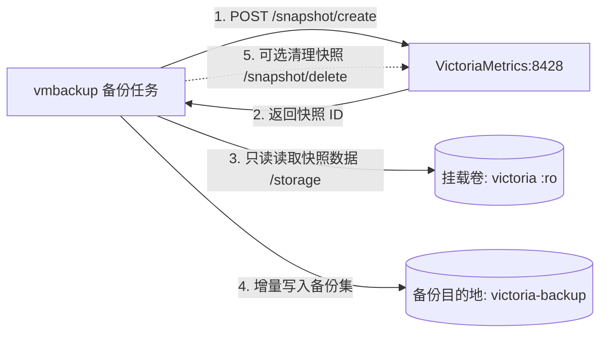

# vmbackup 时序数据快照与增量备份工具

`vmbackup` 是 VictoriaMetrics 官方专用的生产级快照与增量备份工具。它通过向运行中的 VictoriaMetrics 发送快照创建请求，获取瞬时一致性快照，并将数据增量同步至本地持久卷或远程对象存储（如 AWS S3、MinIO、Google Cloud Storage、Azure Blob 等）。

---

## 核心特性

- **零停机瞬时快照**：备份过程完全基于 VictoriaMetrics 的 `/snapshot/create` API，创建快照仅耗时数毫秒，不阻塞读写请求。
- **高效增量备份**：每次仅上传新增和变更的数据块（Parts），历史已上传的数据块自动去重跳过，大幅节约网络带宽与存储空间。
- **存储介质多样**：原生支持本地文件系统（`fs:///`）、AWS S3（`s3:///`）、MinIO、GCS、Azure Blob 等。
- **原子性与容错机制**：如果备份过程中途被中断或网络抖动，下一次执行会自动续传，不会损坏历史已完成的备份集。
- **只读挂载保障安全**：容器内对源数据目录采用 `:ro`（只读）挂载，物理杜绝备份操作对运行中数据库造成的任何写入风险。

---

## 架构拓扑



---

## 运行模式

### 1. 守护进程模式（内置默认）

在默认的 `docker-compose.yml` 中，`vmbackup` 以轻量守护进程模式运行：

- 容器启动后会立即执行一次全量/增量备份。
- 随后按照环境变量 `BACKUP_INTERVAL_SECONDS`（默认 86400 秒，即每天一次）持续休眠等待并定期执行。
- 备份数据保存在宿主机持久化目录 `${DATA_PATH}victoria-backup/`。

### 2. 按需单次手动备份

如果希望在进行系统变更或升级前立刻执行一次备份，可直接使用容器命令：

```bash
docker compose run --rm vmbackup /vmbackup-prod \
  -storageDataPath=/storage \
  -snapshot.createURL=http://victoria-metrics:8428/snapshot/create \
  -dst=fs:///backup/manual-$(date +%Y%m%d%H%M%S)
```

---

## 扩展配置：备份至 S3 或 MinIO

若需要将备份存储到 S3 或内网自建的 MinIO，只需修改 `docker-compose.yml` 中的目标路径 `-dst` 与认证变量：

```yaml
    command:
      - "-storageDataPath=/storage"
      - "-snapshot.createURL=http://victoria-metrics:8428/snapshot/create"
      - "-dst=s3://my-backup-bucket/victoria-metrics-backup"
      - "-customS3Endpoint=http://minio:9000"
    environment:
      - AWS_ACCESS_KEY_ID=your-access-key
      - AWS_SECRET_ACCESS_KEY=your-secret-key
```

---

## 数据灾难恢复指南 (vmrestore)

当发生硬件损毁或数据误删需要恢复时，可使用官方配对工具 `vmrestore`：

### 1. 停止 VictoriaMetrics 写入

```bash
docker compose stop victoria-metrics
```

### 2. 执行数据还原

```bash
docker run --rm \
  -v ${DATA_PATH}victoria:/storage \
  -v ${DATA_PATH}victoria-backup:/backup:ro \
  victoriametrics/vmrestore:v1.151.0 \
  -src=fs:///backup/latest \
  -storageDataPath=/storage
```

### 3. 重启 VictoriaMetrics 服务

```bash
docker compose start victoria-metrics
```

---

## 常用运维指令

### 1. 查看备份任务日志

```bash
docker compose logs -f vmbackup
```

### 2. 检查本地已生成的备份文件结构

```bash
ls -lh ${DATA_PATH:-./data/}victoria-backup/latest
```

### 3. 查看 VictoriaMetrics 当前已有快照

```bash
curl http://localhost:8428/snapshot/list
```
