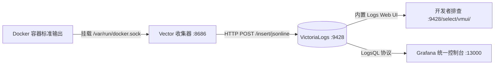

# VictoriaLogs 日志数据库 (Logs Engine)

VictoriaLogs 是一款极速、易用且高压缩比的轻量级日志时序数据库，旨在替代臃肿的 Elasticsearch / Logstash / Kibana (ELK) 架构与复杂的 Grafana Loki。它提供了极佳的全文检索性能、极低的内存与磁盘开销，并原生支持强大的 LogsQL 查询语言。

---

## 📌 核心特性与架构定位

1. **极致轻量与高压缩**：
   - 相比 Elasticsearch 节省高达 90% 的磁盘空间与 80% 的内存消耗，在小内存开发与生产环境中极其平稳。
2. **结构化流式存储 (Streams)**：
   - 支持动态字段索引。在本架构中，利用 `_stream_fields=container_name,stream` 自动对容器名和输出流类型（stdout/stderr）建立数据流，实现毫秒级分区检索。
3. **强大的 LogsQL 查询语法**：
   - 无需复杂的 DSL，采用直观的操作符（`AND`、`OR`、`NOT`、前缀匹配、管道处理与字段统计）。
4. **内置 Web 控制台**：
   - 原生内置 Web 探索界面，访问 `http://localhost:9428/select/vmui/` 即可即时过滤、检索日志。
5. **Grafana 官方插件无缝集成**：
   - 本项目 Grafana 镜像已预置官方 VictoriaLogs 数据源插件，可在 Grafana Explore 页面直接切换日志视图与直方图。

---

## 🏗️ 日志流转拓扑



---

## ⚙️ 核心参数与环境变量

服务定义于 `observability/victoria-logs/docker-compose.yml`：

```yaml
command:
  - "--storageDataPath=/storage"       # 日志落盘持久化目录
  - "--retentionPeriod=1M"              # 日志默认保留 1 个月
  - "--httpListenAddr=:9428"           # 服务对外暴露端口
  - "--memory.allowedPercent=60"        # 内存软限制，防止突发流量占用过多主机内存
```

- **挂载目录**：`${DATA_PATH}victoria-logs:/storage`。
- **对外暴露端口**：`${VICTORIA_LOGS_PORT:-9428}:9428`。
- **网络模式**：加入 `backend`（与 Vector 内部通信）与 `frontend`（可选供网关代理）。

---

## 🚀 常用端点与 LogsQL 查询语法

### 1. 核心 HTTP 端点

| 端点路径 | 方法 | 功能描述 |
| :--- | :--- | :--- |
| `http://localhost:9428/select/vmui/` | GET | 原生内置交互式日志探索 Web 控制台 |
| `http://localhost:9428/insert/jsonline` | POST | 接收换行符分隔的 JSON 日志流写入接口（Vector 目标端点） |
| `http://localhost:9428/select/logsql/query` | GET/POST | 执行 LogsQL 查询并返回 JSON 格式结果 |
| `http://localhost:9428/health` | GET | 健康检查端点（返回 200 OK） |

### 2. 实用 LogsQL 检索示例

访问 `http://localhost:9428/select/vmui/` 或在 Grafana Explore 中输入：

- **搜索包含 error 或 exception 的全部容器日志**：

  ```logsql
  error OR exception
  ```

- **精确检索指定容器的日志**：

  ```logsql
  _stream:{container_name="caddy"}
  ```

- **在 Caddy 容器中检索非 200 响应与警告**：

  ```logsql
  _stream:{container_name="caddy"} AND (status:>299 OR level:warn OR level:error)
  ```

- **排除探针或健康检查噪音**：

  ```logsql
  _stream:{container_name="caddy"} AND NOT "wget"
  ```

- **按容器分组统计日志生成量 (LogsQL 管道语法)**：

  ```logsql
  * | stats by (container_name) count() as lines_count
  ```

---

## 🛠️ 常用运维与自检指令

### 1. 模拟写入测试日志

可通过 curl 直接向 `/insert/jsonline` 写入一条带 Stream 标签的 JSON 日志：

```bash
curl -X POST "http://localhost:9428/insert/jsonline?_stream_fields=container_name,stream&_time_field=timestamp" \
  --data-binary '{"container_name":"test-app","stream":"stdout","timestamp":"'$(date -u +"%Y-%m-%dT%H:%M:%SZ")'","message":"Hello VictoriaLogs from curl test"}'
```

### 2. 查看最近 5 条日志

```bash
curl -G "http://localhost:9428/select/logsql/query" \
  --data-urlencode 'query=*' \
  --data-urlencode 'limit=5'
```

### 3. 服务控制

```bash
# 启动日志存储引擎
docker compose up -d victoria-logs

# 查看容器日志
docker compose logs -f victoria-logs

# 查看数据目录占用空间
du -sh data/victoria-logs/
```
