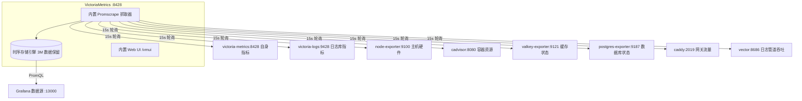

# VictoriaMetrics 时序数据库 (Metrics Engine)

VictoriaMetrics 是整个可观测性技术栈的核心指标存储后端（TSDB）。它具有极高的写入吞吐量、极佳的数据压缩比（通常仅需 Prometheus 的 1/7 磁盘空间）和更低的内存消耗，且 100% 兼容 Prometheus 查询协议（PromQL / MetricsQL）。

---

## 📌 核心功能与架构职责

1. **统一指标抓取中心**：
   - 启用 `--promscrape.config=/etc/prometheus/prometheus.yml` 内置抓取引擎，周期性（默认 15s）主动拉取所有容器与系统指标，省去单独部署 Prometheus 或 vmagent 的维护成本。
2. **长效低成本存储**：
   - 数据落盘至持久化目录 `${DATA_PATH}victoria/`，设置保留期为 3 个月（`--retentionPeriod=3M`）。
3. **内置检索控制台 (vmui)**：
   - 随服务自带极速响应的 Web UI（访问 `http://localhost:8428/vmui`），支持指标自动补全、交互式绘图与基数分析。
4. **Grafana 标准数据源**：
   - 通过 Prometheus 数据源协议无缝对接 Grafana，支持微秒级查询解析。

---

## 🏗️ 抓取目标与拓扑关系

VictoriaMetrics 通过挂载的 `prometheus.yml` 配置文件纳管了当前环境中的 8 个核心监控任务：



---

## ⚙️ 核心配置说明

文件位置：`observability/victoria-metrics/`

- `docker-compose.yml`：容器定义与资源配额。
- `prometheus.yml`：Prometheus 兼容抓取规则。

### 关键启动参数

```yaml
command:
  - "--storageDataPath=/storage"                     # 时序数据持久化路径
  - "--retentionPeriod=3M"                            # 数据保留时间（3 个月）
  - "--httpListenAddr=:8428"                         # 服务监听端口
  - "--promscrape.config=/etc/prometheus/prometheus.yml" # 启用内置指标拉取
  - "--memory.allowedPercent=60"                      # 内存软限制，预留空间防止 OOM
```

### 抓取任务清单 (`prometheus.yml`)

- `victoria-metrics`: 抓取自身的 goroutine、内存、写入吞吐等指标。
- `victoria-logs`: 监控日志引擎写入吞吐与 LogsQL 执行指标。
- `node-exporter`: 宿主机 CPU、内存、磁盘与网络。
- `cadvisor`: 容器资源限制与开销。
- `valkey`: 缓存命中率与内存碎片。
- `postgres`: 数据库连接池与活跃事务。
- `caddy`: 反代请求数、HTTP 状态码分布与耗时。
- `vector`: 日志传输速率及日志转指标的 `docker_log_lines_total`。

---

## 🚀 常用端点与操作指南

### 1. 访问控制台与调试端点

| 端点路径 | 端口协议 | 功能描述 |
| :--- | :--- | :--- |
| `http://localhost:8428/vmui` | HTTP Web | 原生交互式 PromQL 查询与图形化控制台 |
| `http://localhost:8428/targets` | HTTP Web | 查看当前所有抓取 Target 的健康状态与延迟 |
| `http://localhost:8428/health` | HTTP API | 健康检查接口（Docker Healthcheck 依赖） |
| `http://localhost:8428/metrics` | HTTP API | 自身指标导出端点 |
| `http://localhost:8428/api/v1/query_range` | HTTP API | Prometheus 标准范围查询接口 |

### 2. 常用 PromQL / MetricsQL 查询示例

进入 `http://localhost:8428/vmui` 可直接输入执行：

- **宿主机 CPU 使用率**：

  ```promql
  100 - (avg by (instance) (rate(node_cpu_seconds_total{mode="idle"}[1m])) * 100)
  ```

- **容器内存实时工作集**：

  ```promql
  sum by (name) (container_memory_working_set_bytes{name!=""})
  ```

- **各容器日志生成行数速率 (由 Vector 转换推送)**：

  ```promql
  sum by (container_name) (rate(docker_log_lines_total[1m]))
  ```

- **Postgres 活跃连接数**：

  ```promql
  pg_stat_activity_count{state="active"}
  ```

---

## 🛠️ 常用维护命令

```bash
# 启动或重启 VictoriaMetrics 服务
docker compose up -d victoria-metrics

# 查看容器日志
docker compose logs -f victoria-metrics

# 检查健康状态
docker compose exec victoria-metrics wget -q -O - http://127.0.0.1:8428/health

# 重载抓取配置（修改 prometheus.yml 后无需重启容器）
docker compose exec victoria-metrics kill -HUP 1
```
