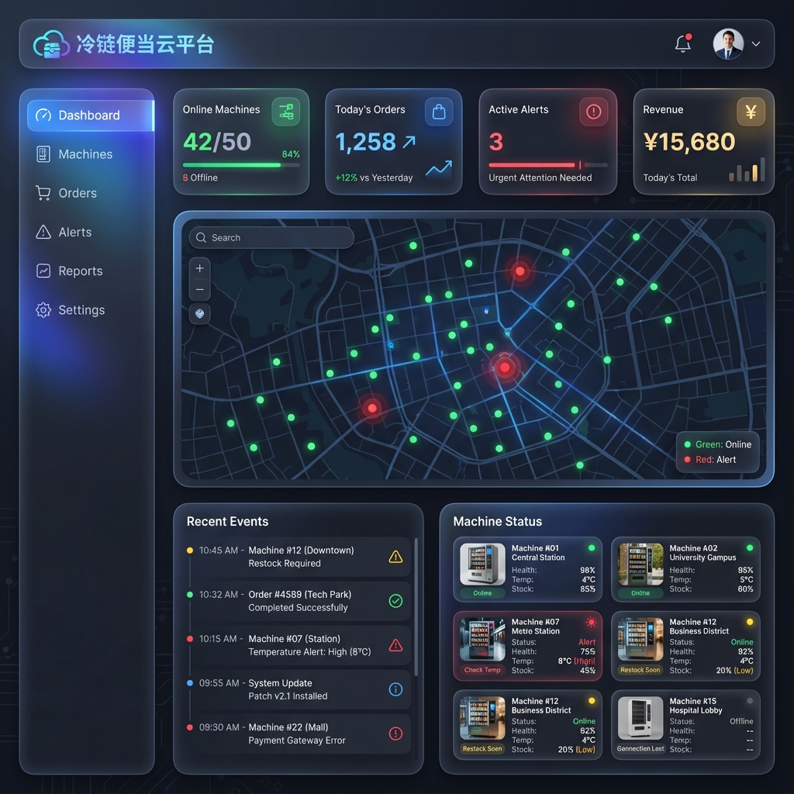
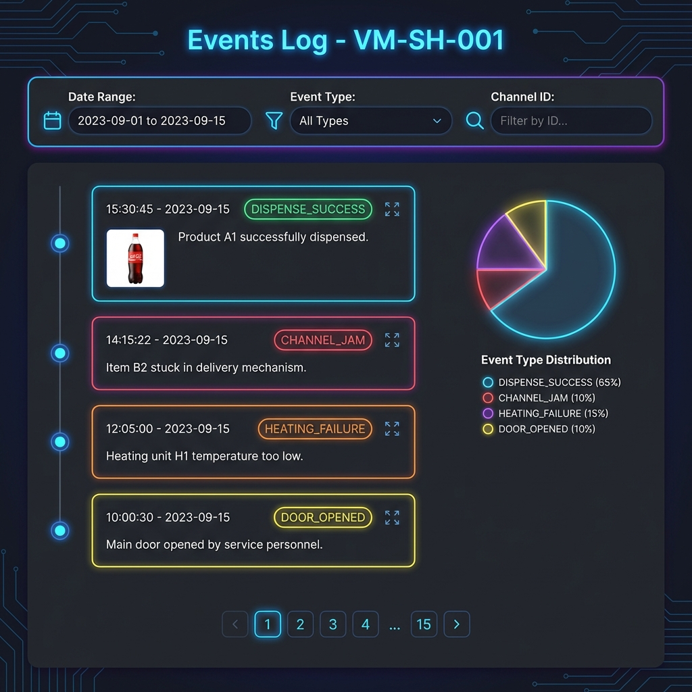
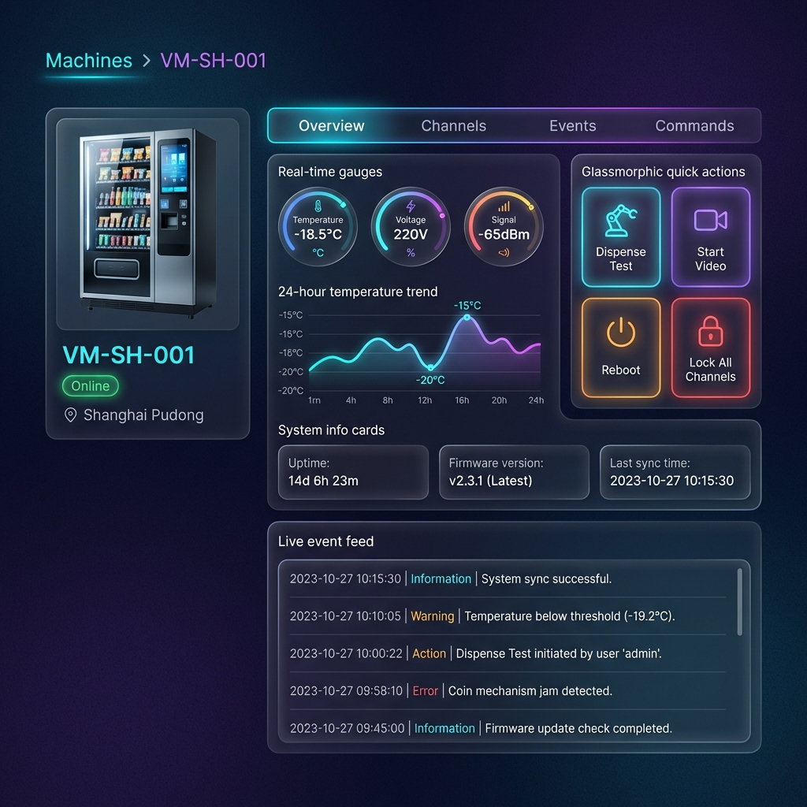

# 冷链便当售货机后台管理系统：UI 交互设计规范

本文档基于 `frozen_meal_vm_iot_design.md` 和 `mqtt_api_doc.md` 定义的业务逻辑，设计后台管理系统的用户界面与交互规范。

---

## 1. 设计原则

*   **深色主题**：IoT 监控场景通常需要长时间查看，深色主题减少视觉疲劳。
*   **实时反馈**：所有数据通过 WebSocket/MQTT over WS 实时推送，无需手动刷新。
*   **一屏聚焦**：关键信息（在线率、告警数）在首屏即可获取。
*   **渐进披露**：从总览到详情，逐层深入。

---

## 2. 页面结构

### 2.1 导航架构

```
├── Dashboard (仪表盘)
├── Machines (设备管理)
│   ├── Machine List (设备列表)
│   └── Machine Detail (设备详情)
│       ├── Overview (概览)
│       ├── Channels (货道管理)
│       ├── Events (事件日志)
│       └── Commands (指令控制)
├── Orders (订单管理)
├── Alerts (告警中心)
├── Reports (数据报表)
└── Settings (系统设置)
```

---

## 3. 核心页面设计

### 3.1 Dashboard (仪表盘)

**目的**：一屏展示全网设备运行概况。

**核心模块**：

| 模块 | 描述 | 数据来源 |
| :--- | :--- | :--- |
| **统计卡片** | 在线/总数、今日订单、活跃告警、今日营收 | 聚合计算 |
| **地图视图** | 所有设备地理分布，颜色标记状态 | `telemetry.location` |
| **最近事件** | 实时滚动的事件流 | `events` 主题订阅 |
| **设备状态** | 缩略图 + 健康指标 | `telemetry` + `status` |

**交互逻辑**：
*   点击地图标记 → 弹出设备摘要卡片 → 跳转详情页
*   告警卡片点击 → 跳转告警中心并自动筛选

**设计稿**：



---

### 3.2 Machine Detail (设备详情)

**目的**：深度监控单台设备的所有维度。

#### Tab 1: Overview (概览)

| 组件 | 展示内容 | 数据字段 |
| :--- | :--- | :--- |
| **实时仪表盘** | 温度、电压、信号强度 | `environment.freezer_temps`, `system.voltage`, `connectivity.rssi` |
| **趋势图表** | 24h 温度曲线 | 历史 `telemetry` 聚合 |
| **系统信息** | 运行时长、固件版本、最后同步 | `system.uptime`, `status.firmware` |
| **快捷操作** | 出餐测试、开启视频、重启、锁定货道 | 对应 `commands` 指令 |

#### Tab 2: Channels (货道管理)

| 组件 | 展示内容 | 交互 |
| :--- | :--- | :--- |
| **货道矩阵** | 48 + 5 个货道的可视化网格 | 点击选中 |
| **状态图例** | 正常(绿)、低库存(黄)、卡货(红)、锁定(灰) | - |
| **详情面板** | 选中货道的库存、最后出货时间 | 锁定/解锁/测试出货 |

**指令映射**：
*   "锁定" → `LOCK_CHANNEL`
*   "解锁" → `UNLOCK_CHANNEL`
*   "测试出货" → `DISPENSE` (test mode)

#### Tab 3: Events (事件日志)

| 列 | 说明 |
| :--- | :--- |
| 时间戳 | ISO 格式 |
| 事件类型 | `DISPENSE_SUCCESS`, `CHANNEL_JAM` 等 |
| 详情 | JSON 数据的关键字段提取 |
| 图片 | 若有 `image_url`，显示缩略图 |

**筛选器**：日期范围、事件类型、货道 ID

**设计稿**：




#### Tab 4: Commands (指令控制)

| 指令 | UI 控件 | 参数 |
| :--- | :--- | :--- |
| `DISPENSE` | 选择器 + 按钮 | meal_cid, sauce_cid, oven_id, heat_seconds |
| `START_VIDEO` | 选择器 + 按钮 | camera_id, duration |
| `STOP_VIDEO` | 按钮 | camera_id |
| `REBOOT` | 确认弹窗 | delay, reason |
| `SET_CONFIG` | 表单 | 动态参数 |

**ACK 展示**：发送指令后，界面显示等待状态，收到 `commands/ack` 后更新结果。

**设计稿**：




---

### 3.3 Alerts Center (告警中心)

**目的**：集中处理所有异常事件。

**核心功能**：

| 功能 | 描述 |
| :--- | :--- |
| **告警列表** | 按时间倒序，支持分页 |
| **严重性标签** | P0(紧急)、P1(严重)、P2(警告)、P3(提示) |
| **快速操作** | 确认、解决、跳转设备 |
| **统计图表** | 告警分布饼图、7日趋势柱状图 |

**告警级别映射**（对应 `frozen_meal_vm_iot_design.md`）：

| 事件类型 | 告警级别 |
| :--- | :--- |
| `VANDALISM_ALERT` | P0 |
| `TEMP_OVERHEAT` | P1 |
| `CHANNEL_JAM` | P1 |
| `HEATING_FAILURE` | P1 |
| `DOOR_OPENED` (非工作时间) | P1 |
| `DISPENSE_FAILED` | P2 |

**设计稿**：


---

### 3.4 Orders Management (订单管理)

**目的**：查看和管理所有出餐订单。

**核心功能**：

| 功能 | 描述 |
| :--- | :--- |
| **订单列表** | 按时间倒序，支持分页和搜索 |
| **状态筛选** | 全部、已完成、失败、处理中 |
| **订单详情** | 订单号、设备ID、货道、金额、时间 |
| **统计面板** | 今日订单数、成功率、营收额 |

**设计稿**：


---

## 4. 实时数据订阅

后台管理系统通过 MQTT over WebSocket 订阅以下主题：

| 主题模式 | 用途 |
| :--- | :--- |
| `v1/vm/+/telemetry` | 全网遥测数据 |
| `v1/vm/+/events` | 全网事件流 |
| `v1/vm/+/status` | 设备上下线 |
| `v1/vm/{id}/commands/ack` | 指定设备指令响应 |

---

## 5. 组件规范

### 5.1 状态徽章

| 状态 | 颜色 | 场景 |
| :--- | :--- | :--- |
| Online | `#00FF88` (绿) | 设备在线 |
| Offline | `#FF4444` (红) | 设备离线 |
| Warning | `#FFAA00` (橙) | 有未处理告警 |
| Maintenance | `#888888` (灰) | 维护模式 |

### 5.2 图表配色

*   **温度曲线**：渐变蓝 (#00C8FF → #0066FF)
*   **电压曲线**：渐变紫 (#AA66FF → #6600FF)
*   **事件分布**：按类型区分，使用调色板

### 5.3 按钮层级

| 层级 | 样式 | 用途 |
| :--- | :--- | :--- |
| Primary | 填充 + 渐变 | 主操作（出餐、保存） |
| Secondary | 描边 | 次要操作（取消、返回） |
| Danger | 红色填充 | 危险操作（重启、锁定） |
| Ghost | 透明 + 文字 | 链接式操作 |

---

## 6. 交互流程示例

### 6.1 远程出餐流程

```
用户选择货道 M-12, 调料 S-01, 微波炉 OVEN_A
    ↓
点击 "执行出餐"
    ↓
前端发送 DISPENSE 指令到 v1/vm/{id}/commands
    ↓
界面显示 "执行中..." 状态
    ↓
订阅 v1/vm/{id}/commands/ack
    ↓
收到 ACK: status=success
    ↓
界面显示 "出餐成功" + 弹出抓拍图片
```

### 6.2 告警处理流程

```
收到 TEMP_OVERHEAT 事件
    ↓
告警中心新增一条 P1 记录
    ↓
通知栏显示红点 + 数字
    ↓
运维人员点击告警
    ↓
查看详情：温区索引、当前温度、阈值
    ↓
点击 "跳转设备" → 进入设备详情页
    ↓
确认问题后点击 "已解决"
    ↓
告警状态变为 Resolved
```

---

## 7. 技术栈建议

| 层 | 推荐技术 |
| :--- | :--- |
| 前端框架 | React / Vue 3 |
| UI 组件库 | Ant Design / Arco Design |
| 状态管理 | Zustand / Pinia |
| 图表 | ECharts / Chart.js |
| 地图 | 高德地图 / Mapbox |
| 实时通信 | MQTT.js (over WebSocket) |
| 样式 | Tailwind CSS / CSS Variables |

---
*Created by Antigravity - Advanced Agentic Coding Assistant*
