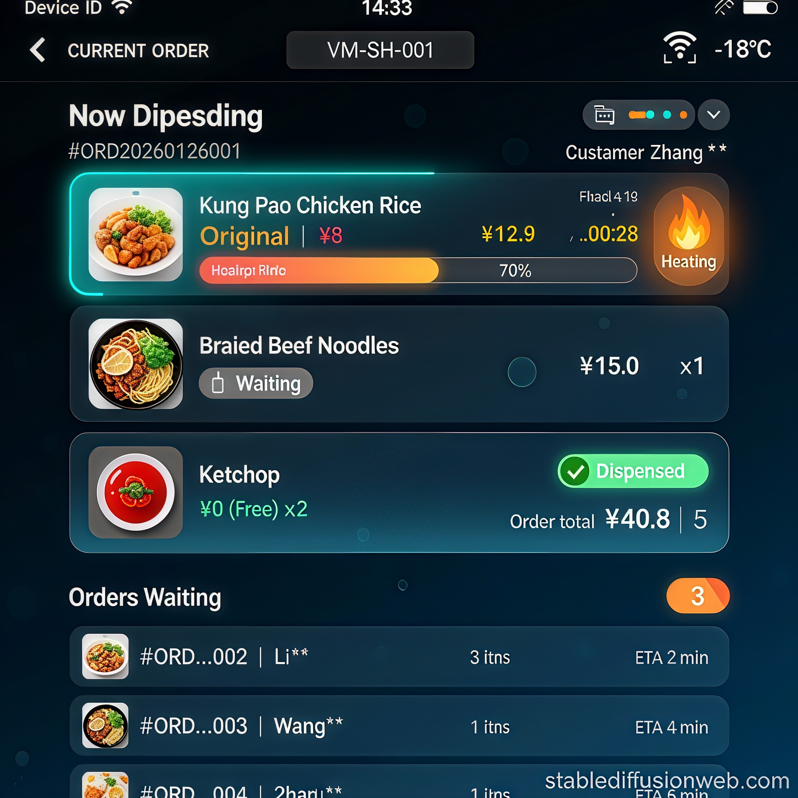

# 售货机终端屏幕交互设计规范 (Device UI)

本文档定义了售货机自带触摸屏的客户交互界面规范，涵盖了从待机扫码到多商品出餐的全流程。

---

## 1. 页面定义与流程

### 1.1 设备待机页面 (Standby)

**目的**：引导用户扫码下单，展示设备健康状态与促销信息。

**设计稿**：

**交互要点**：
*   **大尺寸二维码**：置于屏幕视觉中心，带呼吸灯特效 border。
*   **状态展示**：左上角或顶部显式声明“设备正常”及实时冷冻温度。
*   **促销轮播**：底部作为特价商品或新品推介区域。

---

### 1.2 订单出餐进度页面 (Dispensing Queue)

**目的**：展示当前订单的出餐/加热进度，并告知后续等待用户。

**设计稿**：

**核心组件**：

| 组件 | 描述 | 数据字段映射 |
| :--- | :--- | :--- |
| **当前订单卡片** | 高亮显示当前正在服务的订单号和客户名（脱敏） | `v1/vm/{id}/commands` 相关指令关联 |
| **商品进度列表** | 包含商品图片、名称、加热倒计时、状态（加热中/等待/已出货） | 内部状态流转 |
| **加热进度条** | 动态百分比显示，匹配微波炉实际工作功率 | 模拟器 `oven.power` 关联 |
| **等待队列** | 下方显示后序 3 个订单的概要信息与预计等待时长 | 队列任务堆栈 |

**交互逻辑**：
*   **分区显示**：上部为当前订单详情，下部为全局队列。
*   **视觉反馈**：正在加热的项目使用橙色发光效果，已出货的项目显示绿色打勾。
*   **多商品并行**：若有两台微波炉，可同时显示两个商品的加热进度。

---

## 2. 视觉规范

*   **对比度**：使用极高对比度的深色背景，确保在强光环境下（如商场大厅）依然清晰。
*   **字体尺寸**：订单编号与状态文本字体不小于 32px，确保排队用户在 2-3 米外可辨识。
*   **配色方案**：
    *   **青色 (#00F2FF)**：设备正常、WiFi、连接相关。
    *   **橙色 (#FF8A00)**：加热中、警告、倒计时。
    *   **绿色 (#00FF88)**：出餐完成、支付成功。

---
---

## 3. AI 提示词库 (Prompt Lib)

为了保持视觉风格的一致性，以下是生成本设计稿所使用的核心 AI 提示词：

### 3.1 设备待机页面
**中文版：**
> 冷链便当自动售货机触摸屏界面设计，竖屏布局。顶部状态栏显示设备编号 "VM-SH-001"、WiFi 信号图标、当前时间 "14:20"。主区域中央大尺寸二维码带发光边框，上方文字 "扫码取餐"，下方 "请使用微信或支付宝扫码支付"。底部促销横幅 "今日特惠"。深色玻璃拟态风格，青色和橙色霓虹灯效。

**English Version:**
> Vending machine touchscreen UI, portrait 9:16, dark theme, large centered QR code with cyan neon glow, Chinese text "扫码取餐", status bar showing "VM-SH-001" and WiFi icon, temperature display "-18°C", promotional banner at bottom, glassmorphism style, deep blue gradient background, modern premium tech aesthetic.

### 3.2 订单出餐进度页面
**中文版：**
> 冷链便当自动售货机出餐队列页面，竖屏 9:16。顶部显示设备状态。当前处理区域高亮显示订单号和脱敏后的客户名。商品列表包含图片、名称、加热进度条（70%）和剩余时间。正在加热的项目带橙色发光进度。底部显示等待中的订单队列和预计等待时间。现代高端科技风，高对比度。

**English Version:**
> Vending machine touchscreen UI, order dispensing queue page, portrait 9:16, dark theme, glassmorphism cards. Current order section showing customer "Zhang **" order "#ORD001" with food items: Kung Pao Chicken with 70% heating progress bar and orange pulsing glow. Bottom section showing 3 waiting orders queue with customer names and ETA times. Deep blue gradient background, cyan and orange neon accents, modern premium tech style.

---
*Created by Antigravity - Advanced Agentic Coding Assistant*
