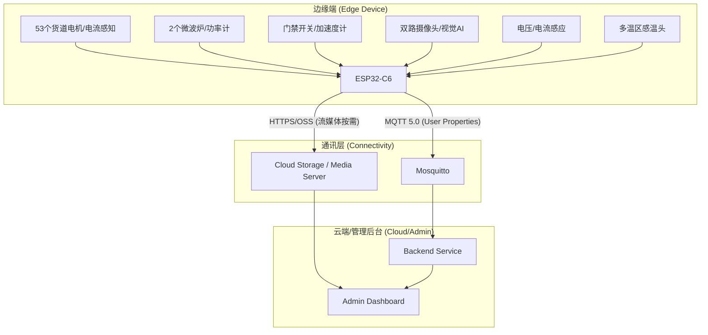

# 冷链便当自动售货机：全栈物联网系统设计方案 (MQTT 5.0 版)

本项目针对集成了"冷冻存储 + 自动化分拣 + 快速微波加热 + 视觉监控"功能的智能售货机，设计了一套基于边缘计算与 **MQTT 5.0** 协议的高可用运行与监控架构。

---

## 硬件规格与模块定义

*   **餐食存储区**：全冷冻冰柜，配置 48 个独立货道，每个货道容量为 4 盒便当。
*   **调料分拣区**：配置 5 个专用货道，用于投放番茄酱、沙拉酱等。
*   **加热处理区**：配置 2 台工业级微波炉，支持出餐前的自动加热逻辑。
*   **视觉监控区**：配置 2 路摄像头（出餐口高清抓拍 + 顶部防盗监控）。
*   **控制核心**：ESP32-C6 级主控，处理 53 个电机的传动逻辑及全量传感器采集。

---

## 系统架构设计



---

## MQTT 5.0 通讯协议设计

利用 `User Properties` (用户属性) 标记事件的优先级和介质类型。

| 主题类别 | 主题格式 (Topic) | 描述 | Qos | 核心 Payload 字段 |
| :--- | :--- | :--- | :--- | :--- |
| **全量遥测** | `v1/vm/{id}/telemetry` | 定时上报整机健康状态、电源、位置等 | 0 | `system`, `environment`, `connectivity` |
| **关键事件** | `v1/vm/{id}/events` | 出餐成功、卡货、加热失效、**视觉快照** | 1 | `event_type`, `image_url`, `data` |
| **状态维护** | `v1/vm/{id}/status` | LWT 遗嘱消息，实时感知设备连接状态 | 1 | `status: "online"/"offline"` |
| **指令接收** | `v1/vm/{id}/commands` | 执行出餐、**远程实时预览**、重启 | 2 | `action`, `params`, `cmd_id` |
| **OTA 升级** | `v1/vm/{id}/ota` | 固件升级指令与进度回报 | 2 | `firmware_url`, `version`, `progress` |

---

## 视觉监控与流量策略 (Traffic Optimization)

为了平衡监控效果与昂贵的 4G/5G 流量成本，采用"事件驱动"金字塔策略：

| 策略级别 | 媒介类型 | 触发条件 | 单次流量 | 流量预期 (每月) |
| :--- | :--- | :--- | :--- | :--- |
| **低频 (常态)** | MQTT 文本 | 10s 定时遥测 | < 1KB | 约 250MB |
| **中频 (重要)** | **JPEG 快照** | 出餐成功、异常报警、非法开门 | 约 200KB | 约 1.5GB (按250次出餐/天) |
| **极低频 (紧急)** | **H.264 视频流** | 客服介入、远程故障排查 | 约 4MB/min | 按需统计 (通常 < 500MB) |

### 核心优化逻辑：
1.  **图片不出 Broker**：摄像头抓拍后上传至云存储 (OSS/MinIO)，MQTT payload 仅传输图片的 URL。
2.  **按需推流**：平时不开启视频流，仅在接收到后端指令 `START_LIVE_STREAM` 时开启取流传输，并限定 2 分钟后自动断连。

---

## 全量传感器遥测定义

### 1. 系统状态 (`system`)
*   `voltage`: 当前工作电压 (V)，异常波动 (>240V 或 <200V) 将损坏微波炉磁控管。
*   `current`: 即时总电流 (A)，用于计算运行功率。
*   `door_closed`: 物理安全监测，判定补货/维修门是否合严。
*   `uptime`: 设备自上次重启后的运行秒数。

### 2. 生鲜环境 (`environment`)
*   `freezer_temps`: 4 路分布式冷冻温区采样 (-18.0℃ 级)。
*   `ambient_temp`: 机器外部环境温湿度。
*   `vibration_g`: 三轴加速度计合成 G 值，用于判定剧烈撞击。

### 3. 连接与地理 (`connectivity` & `location`)
*   `rssi`: 4G/5G 信号强度 (dBm)。
*   `lat / lng`: GPS 坐标，用于后端地图聚合展示。

---

## OTA 固件升级设计

### 升级流程
1.  **服务端下发**：通过 `v1/vm/{id}/ota` 主题推送升级指令。
2.  **设备校验**：校验固件签名 (SHA256 + RSA)，防止中间人攻击。
3.  **分片下载**：通过 HTTPS 从 OSS 下载固件包，支持断点续传。
4.  **灰度发布**：先对 5% 设备升级，观察 24h 无异常后全量推送。

### OTA 指令结构
```json
{
  "cmd_id": "OTA20260126001",
  "action": "START_OTA",
  "params": {
    "version": "5.1.0",
    "firmware_url": "https://oss.example.com/fw/v5.1.0.bin",
    "checksum": "sha256:a3b8c9d...",
    "force": false
  }
}
```

### OTA 进度回报
```json
{
  "event_type": "OTA_PROGRESS",
  "data": {
    "version": "5.1.0",
    "stage": "downloading",
    "progress": 45,
    "error": null
  }
}
```

| stage 枚举 | 说明 |
| :--- | :--- |
| `downloading` | 正在下载固件 |
| `verifying` | 校验签名中 |
| `installing` | 写入 Flash |
| `rebooting` | 重启生效 |
| `success` | 升级成功 |
| `failed` | 升级失败 |

---

## 本地策略引擎 (Edge Policy)

当设备离线或网络不稳定时，边缘端需具备自主决策能力：

| 触发条件 | 本地动作 | 说明 |
| :--- | :--- | :--- |
| 冷冻温度 > -10℃ 持续 5min | 锁定所有货道 | 防止变质食品售出 |
| 震动 G 值 > 3.0 | 触发蜂鸣器 + 抓拍 | 现场威慑 + 证据留存 |
| 微波炉功率 < 500W | 切换至备用微波炉 | 自动故障转移 |
| 电压 < 190V 或 > 250V | 关闭微波炉电源 | 保护高压元件 |
| 网络断开 > 30min | 进入离线模式 | 缓存订单，恢复后补发 |

---

## 数据持久化与补发策略

### 离线缓存机制
*   **存储介质**：ESP32-C6 内置 4MB Flash，划分 1MB 作为环形缓冲区。
*   **缓存内容**：遥测数据 + 关键事件（最多保留最近 500 条）。
*   **写入策略**：网络断开时，数据先写入 Flash；重连后按时间顺序补发。

### 补发逻辑
1.  设备重连后，检查 Flash 中是否有未发送数据。
2.  按 FIFO 顺序逐条发送至 `v1/vm/{id}/events`，并标记 `User Property: backfill=true`。
3.  服务端根据 `backfill` 属性区分实时数据与历史补发数据。

---

## 安全加固设计

### 传输层安全
*   **TLS 1.3**：所有 MQTT 连接必须使用 TLS 加密。
*   **双向认证**：设备端预置 CA 证书，校验 Broker 身份；Broker 校验设备证书。

### 应用层安全
*   **Payload 签名**：关键指令 (如 DISPENSE, REBOOT) 需携带 HMAC-SHA256 签名。
*   **防重放攻击**：每条指令包含 `timestamp` 和 `nonce`，超过 60s 的指令自动拒绝。
*   **Token 轮换**：设备每 24h 自动刷新认证 Token。

### 物理安全
*   **防拆检测**：机箱内安装光敏传感器，开箱即触发告警。
*   **日志审计**：所有指令执行记录写入 Flash，支持远程导出。

---

## 运维告警规则

| 告警级别 | 触发条件 | 通知方式 | 响应时效 |
| :--- | :--- | :--- | :--- |
| **紧急 (P0)** | 设备离线 > 10min / 暴力告警 | 电话 + 短信 | 15min 内响应 |
| **严重 (P1)** | 冷冻超温 / 微波炉故障 | 短信 + 邮件 | 1h 内处理 |
| **警告 (P2)** | 库存低于 20% / 信号弱 | 邮件 + Dashboard | 当日处理 |
| **提示 (P3)** | 固件版本过旧 / 日志接近满 | Dashboard | 下次维护处理 |

---

## BOM 硬件清单 (参考)

| 类别 | 型号 | 数量 | 用途 | 参考单价 |
| :--- | :--- | :--- | :--- | :--- |
| 主控 | ESP32-C6-WROOM-1 | 1 | 边缘计算核心 | ¥25 |
| 温度传感器 | SHT40 (I2C) | 4 | 冷冻温区采样 | ¥15 |
| 加速度计 | MPU6050 | 1 | 震动/倾斜检测 | ¥8 |
| 电流传感器 | ACS712-20A | 2 | 微波炉功率监测 | ¥12 |
| 电压传感器 | ZMPT101B | 1 | 市电电压采样 | ¥18 |
| 红外对射 | E18-D80NK | 53 | 货道掉落检测 | ¥5 |
| 霍尔传感器 | A3144 | 2 | 门磁开关 | ¥2 |
| 摄像头 | OV2640 | 2 | 抓拍/监控 | ¥35 |
| 4G 模组 | SIM7600CE | 1 | 蜂窝网络连接 | ¥120 |
| GPS 模组 | ATGM336H | 1 | 定位 | ¥25 |

---

## MQTT 5.0 核心应用案例

1.  **图片/视频上下文关联**：在发送 `image_url` 事件时，通过 `User Property` 携带 `original_request_id`，使后端能精准将图片与特定的订单关联。
2.  **流量节约**：利用 `Topic Alias` 减少遥测报文中重复主题名的字节开销（在高频上报场景可节省 ~5% 总流量）。
3.  **指令超时控制**：对于视频流开启指令，设置消息过期时间，防止设备离线过久重连后意外开启视频浪费流量。
4.  **灰度发布**：OTA 升级时，通过 `User Property` 携带 `rollout_group`，实现分批次固件推送。

---
*Created by Antigravity - Advanced Agentic Coding Assistant*